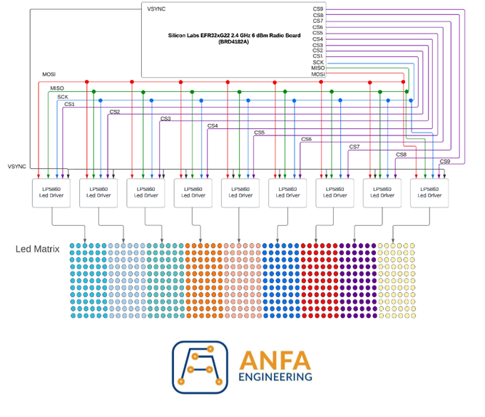
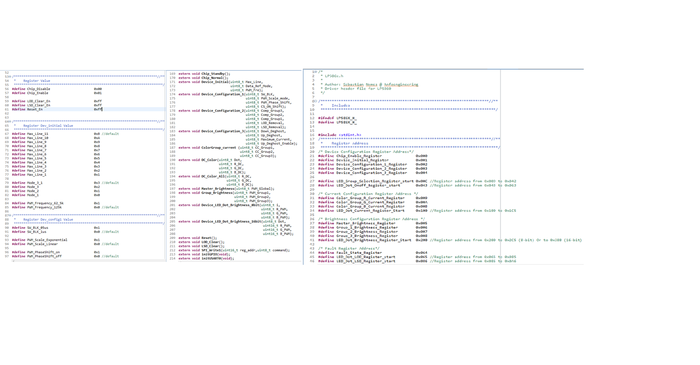
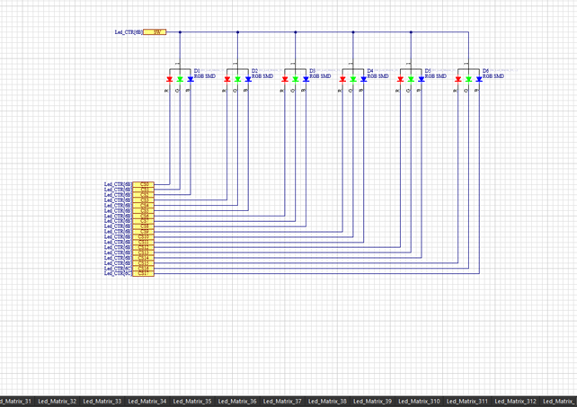
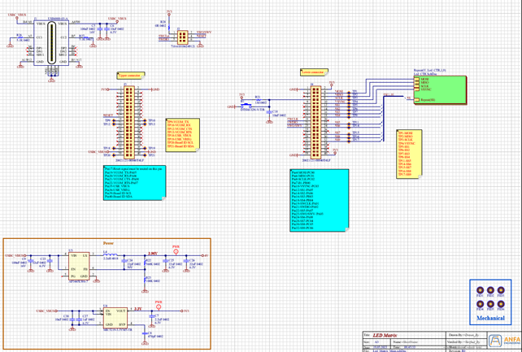

# **LED Matrix Project**

This project was carried out to obtain a bachelor's degree in Electrical Engineering, at the Politehnica University Timisoara. The purpose of this project is to design a matrix display of light-emitting diodes, controlled through a user-oriented application. The goal is to provide the user with a comprehensive and intuitive functionality of the entire electrical panel.
It is based on the correct and efficient implementation of multiple integrated circuits, alongside 594 tricolor light-emitting diodes, in order to create an electrical display where each diode is independently controlled through software. This repo follows the entire process of creating the electrical circuit, starting with the design of the electrical schematic, symbols, and corresponding footprints, followed by circuit board layout, programming of the devices used, and testing the functionality of the entire circuit.

For the creation of the electrical schematic and circuit board layout, Altium Designer, one of the most advanced and well-documented applications in the field, was used. For the software development and testing, the integrated development environment called Simplicity Studio v5, developed by Silicon Labs for programming their microcontrollers, was utilized.

The usefulness of this project is demonstrated in devices encountered daily in everyday life, whether it be price displays, advertising boards, smart street lighting, or LED screens. These circuits provide an advantageous alternative, as they consume low amounts of energy. While their primary purpose is to produce light, they are frequently used to enhance the appearance of a product as well.

## Block Diagram
This is the block diagram of the electric cirucit presented in this project. 

In the top part of the image, represented as a white rectangle, is the microcontroller, the main component that controls the entire circuit. It is the wireless module called BRD4182A Wireless Gecko, which integrates an EFR32MG22 microcontroller. This module communicates with the other components through the SPI interface. The main connections of the circuit have also been depicted, including the aforementioned SPI connection, as well as 10 other signals controlled by the processor through the General-Purpose Input/Output (GPIO) pins.

Each signal has been represented with a different color for easy distinction. The 9 signals labeled CS1..9, short for Chip Select, are necessary for the SPI communication interface and are independent for each device being communicated with. The signals MOSI (Master-Output-Slave-Input), MISO (Master-Input-Slave-Output), and CLK (Clock) are common for all receiving devices. The SPI protocol and its connections are described in detail in the following chapter.

In this case, the receiving devices for the SPI communication are nine integrated circuits, which are responsible for controlling a maximum of 66 RGB LEDs each. These circuits are called LP5860 Led Matrix Driver and are developed by Texas Instruments. Therefore, the main display panel consists of 596 diodes that are independently controlled by the microcontroller. Each matrix corresponding to each LP5860 circuit has been represented in different colors for easy differentiation. The VSYNC signal is an important component of the circuit, as it synchronizes all the LED drivers, facilitating smooth transitions from one matrix controlled by a driver to another.

## Hardware Design
### Electrical Schematic

Within this project, the electrical schematic was divided into three smaller schematics, each positioned on a different page. The first stage involved creating the electrical schematic of the integrated circuit responsible for controlling the LED diodes. The datasheet description of the circuit was carefully followed to correctly implement this component. The final LED driver schematic is represented in the figure below.

The power supply for this circuit is provided through a signal called 4V, which comes from the circuit's power supply block. This signal is responsible for powering the circuit and providing voltage to the VLED pin, which is responsible for powering the diodes. This signal requires specific filtering capacitors for protection. Two additional resistors and capacitors have been placed according to the component's datasheet to enable communication through the SPI (Serial Peripheral Interface) serial interface. The signals SCLK, MOSI, MISO, SS, and VSYNC are signals that reach this component from the wireless module connector.

  On the right side of this electrical schematic, the technique of multiplying elements of the same type was used, a technique known as Multi-Channel Design. In this case, it was necessary to multiply a row of electroluminescent diodes within a specific matrix of a single LED driver. The circuit to be multiplied is represented in the figure below. 

This line of diodes shown in needs to be multiplied 11 times to create a complete matrix of a single LP5860 integrated circuit. This multiplication is achieved using the technique described earlier, assigning 11 different channels for the multiplication.

The line named SW is configured as a common anode for each diode, so 11 such lines are required from the controller. The CS lines separately control the cathode of each diode, thus a total of 18 such lines need to be controlled simultaneously.  In this case, a resistor with a value of 10 Ohms was chosen because the LP5860 circuit incorporates a programmable current source. By placing a resistance on the control line of each diode, the current value will not be the one provided through the software program, thus affecting their brightness.

After completing the LED driver's electric circuit, the Multi-Channel method was reused to safely multiply this circuit. It should be noted that 9 such LED drivers were included, each implementing a separate LED matrix. Therefore, the LED driver circuit had to be multiplied 9 times as well. As can be seen in the above picutres, each circuit to be multiplied was assigned separate multiplication channels. In the case of the LED driver, 9 channels were assigned, and in the case of the LED diodes, 99 channels were assigned. It can be inferred that the Multi-Channel method significantly reduced the working time. 

The last page of the electrical schematic is the most complex one, encapsulating the majority of the components used in this project. This page has been divided into regions for easy reading and understanding of the circuits, as can be seen in the image below.

