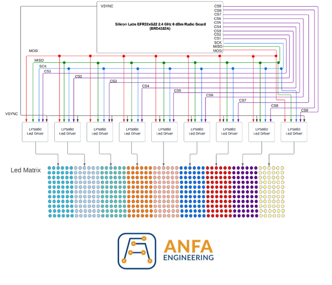

# **LED-Matrix-Electronics-University-Diploma**

This project was carried out to obtain a bachelor's degree in Electronics, at the Politehnica University Timisoara. The purpose of this project is to design a matrix display of light-emitting diodes, controlled through a user-oriented application. The goal is to provide the user with a comprehensive and intuitive functionality of the entire electrical panel.
It is based on the correct and efficient implementation of multiple integrated circuits, alongside 594 tricolor light-emitting diodes, in order to create an electrical display where each diode is independently controlled through software. This repo follows the entire process of creating the electrical circuit, starting with the design of the electrical schematic, symbols, and corresponding footprints, followed by circuit board layout, programming of the devices used, and testing the functionality of the entire circuit.

For the creation of the electrical schematic and circuit board layout, Altium Designer, one of the most advanced and well-documented applications in the field, was used. For the software development and testing, the integrated development environment called Simplicity Studio v5, developed by Silicon Labs for programming their microcontrollers, was utilized.

The usefulness of this project is demonstrated in devices encountered daily in everyday life, whether it be price displays, advertising boards, smart street lighting, or LED screens. These circuits provide an advantageous alternative, as they consume low amounts of energy. While their primary purpose is to produce light, they are frequently used to enhance the appearance of a product as well.

## Block Diagram
This is the block diagram of the electric cirucit presented in this project. 

In the top part of the image, represented as a white rectangle, is the microcontroller, the main component that controls the entire circuit. It is the wireless module called BRD4182A Wireless Gecko, which integrates an EFR32MG22 microcontroller. This module communicates with the other components through the SPI interface. The main connections of the circuit have also been depicted, including the aforementioned SPI connection, as well as 10 other signals controlled by the processor through the General-Purpose Input/Output (GPIO) pins.

Each signal has been represented with a different color for easy distinction. The 9 signals labeled CS1..9, short for Chip Select, are necessary for the SPI communication interface and are independent for each device being communicated with. The signals MOSI (Master-Output-Slave-Input), MISO (Master-Input-Slave-Output), and CLK (Clock) are common for all receiving devices. The SPI protocol and its connections are described in detail in the following chapter.

In this case, the receiving devices for the SPI communication are nine integrated circuits, which are responsible for controlling a maximum of 66 RGB LEDs each. These circuits are called LP5860 Led Matrix Driver and are developed by Texas Instruments. Therefore, the main display panel consists of 596 diodes that are independently controlled by the microcontroller. Each matrix corresponding to each LP5860 circuit has been represented in different colors for easy differentiation. The VSYNC signal is an important component of the circuit, as it synchronizes all the LED drivers, facilitating smooth transitions from one matrix controlled by a driver to another.

## Hardware Design
### Electrical Schematic

Within this project, the electrical schematic was divided into three smaller schematics, each positioned on a different page. The first stage involved creating the electrical schematic of the integrated circuit responsible for controlling the LED diodes. The datasheet description of the circuit was carefully followed to correctly implement this component. The final LED driver schematic is represented in the figure below.

