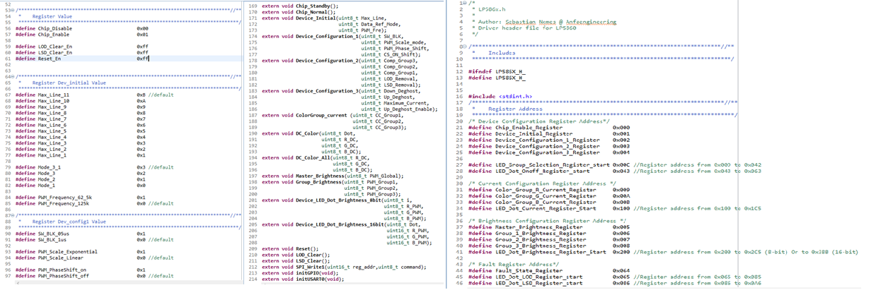
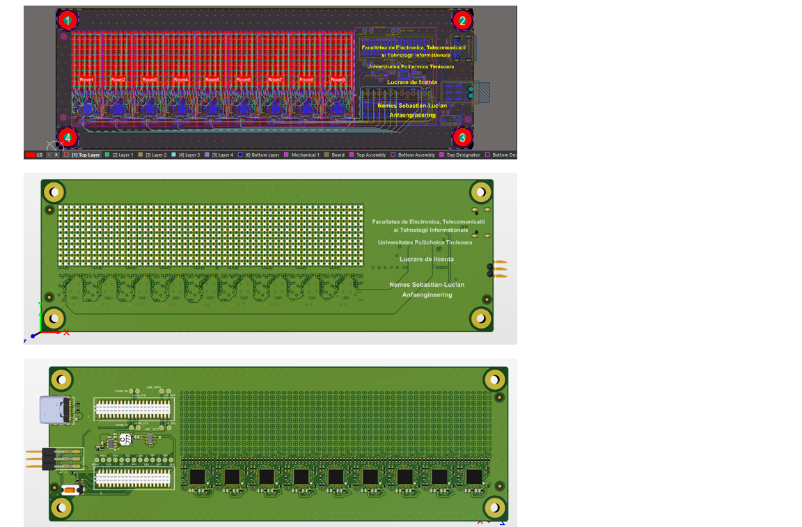
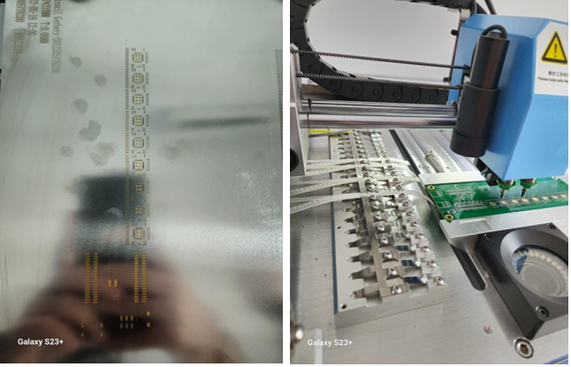
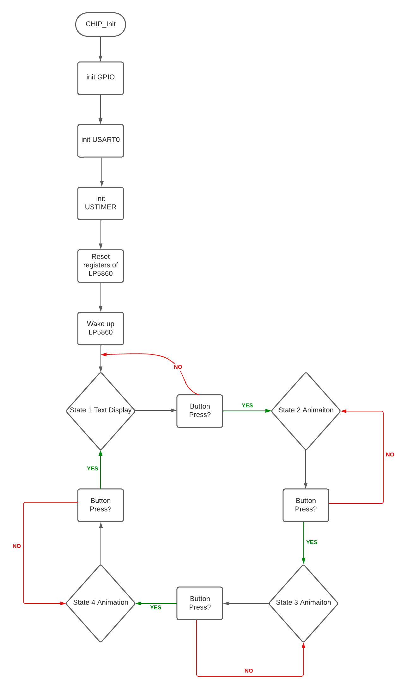
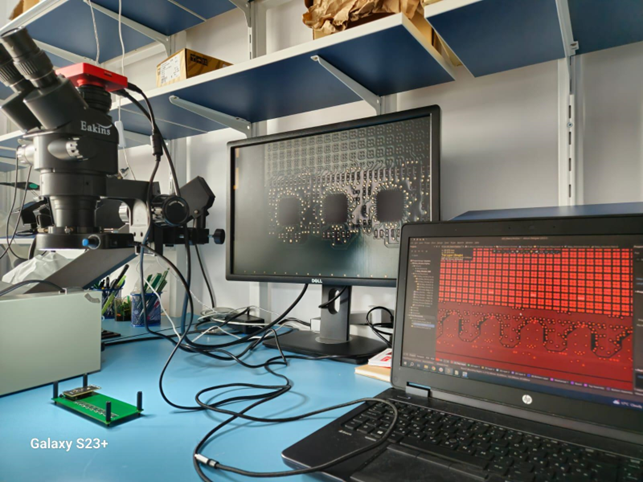
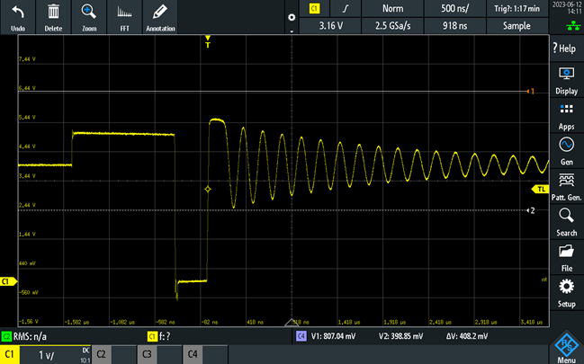
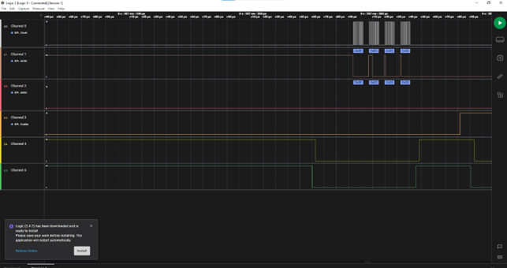

# **LED Matrix Project**

This project was carried out to obtain a bachelor's degree in Electrical Engineering, at the Politehnica University Timisoara. The purpose of this project is to design a matrix display of light-emitting diodes, controlled through a user-oriented application. The goal is to provide the user with a comprehensive and intuitive functionality of the entire electrical panel.
It is based on the correct and efficient implementation of multiple integrated circuits, alongside 594 tricolor light-emitting diodes, in order to create an electrical display where each diode is independently controlled through software. This repo follows the entire process of creating the electrical circuit, starting with the design of the electrical schematic, symbols, and corresponding footprints, followed by circuit board layout, programming of the devices used, and testing the functionality of the entire circuit.

For the creation of the electrical schematic and circuit board layout, Altium Designer, one of the most advanced and well-documented applications in the field, was used. For the software development and testing, the integrated development environment called Simplicity Studio v5, developed by Silicon Labs for programming their microcontrollers, was utilized.

The usefulness of this project is demonstrated in devices encountered daily in everyday life, whether it be price displays, advertising boards, smart street lighting, or LED screens. These circuits provide an advantageous alternative, as they consume low amounts of energy. While their primary purpose is to produce light, they are frequently used to enhance the appearance of a product as well.

## Block Diagram
This is the block diagram of the electric cirucit presented in this project. 

In the top part of the image, represented as a white rectangle, is the microcontroller, the main component that controls the entire circuit. It is the wireless module called BRD4182A Wireless Gecko, which integrates an EFR32MG22 microcontroller. This module communicates with the other components through the SPI interface. The main connections of the circuit have also been depicted, including the aforementioned SPI connection, as well as 10 other signals controlled by the processor through the General-Purpose Input/Output (GPIO) pins.

Each signal has been represented with a different color for easy distinction. The 9 signals labeled CS1..9, short for Chip Select, are necessary for the SPI communication interface and are independent for each device being communicated with. The signals MOSI (Master-Output-Slave-Input), MISO (Master-Input-Slave-Output), and CLK (Clock) are common for all receiving devices. The SPI protocol and its connections are described in detail in the following chapter.

In this case, the receiving devices for the SPI communication are nine integrated circuits, which are responsible for controlling a maximum of 66 RGB LEDs each. These circuits are called LP5860 Led Matrix Driver and are developed by Texas Instruments. Therefore, the main display panel consists of 596 diodes that are independently controlled by the microcontroller. Each matrix corresponding to each LP5860 circuit has been represented in different colors for easy differentiation. The VSYNC signal is an important component of the circuit, as it synchronizes all the LED drivers, facilitating smooth transitions from one matrix controlled by a driver to another.

## **Hardware Design**
### Electrical Schematic

Within this project, the electrical schematic was divided into three smaller schematics, each positioned on a different page. The first stage involved creating the electrical schematic of the integrated circuit responsible for controlling the LED diodes. The datasheet description of the circuit was carefully followed to correctly implement this component. The final LED driver schematic is represented in the figure below.

The power supply for this circuit is provided through a signal called 4V, which comes from the circuit's power supply block. This signal is responsible for powering the circuit and providing voltage to the VLED pin, which is responsible for powering the diodes. This signal requires specific filtering capacitors for protection. Two additional resistors and capacitors have been placed according to the component's datasheet to enable communication through the SPI (Serial Peripheral Interface) serial interface. The signals SCLK, MOSI, MISO, SS, and VSYNC are signals that reach this component from the wireless module connector.

  On the right side of this electrical schematic, the technique of multiplying elements of the same type was used, a technique known as Multi-Channel Design. In this case, it was necessary to multiply a row of electroluminescent diodes within a specific matrix of a single LED driver. The circuit to be multiplied is represented in the figure below. 

This line of diodes shown in needs to be multiplied 11 times to create a complete matrix of a single LP5860 integrated circuit. This multiplication is achieved using the technique described earlier, assigning 11 different channels for the multiplication.

The line named SW is configured as a common anode for each diode, so 11 such lines are required from the controller. The CS lines separately control the cathode of each diode, thus a total of 18 such lines need to be controlled simultaneously.  In this case, a resistor with a value of 10 Ohms was chosen because the LP5860 circuit incorporates a programmable current source. By placing a resistance on the control line of each diode, the current value will not be the one provided through the software program, thus affecting their brightness.

After completing the LED driver's electric circuit, the Multi-Channel method was reused to safely multiply this circuit. It should be noted that 9 such LED drivers were included, each implementing a separate LED matrix. Therefore, the LED driver circuit had to be multiplied 9 times as well. As can be seen in the above picutres, each circuit to be multiplied was assigned separate multiplication channels. In the case of the LED driver, 9 channels were assigned, and in the case of the LED diodes, 99 channels were assigned. It can be inferred that the Multi-Channel method significantly reduced the working time. 

The last page of the electrical schematic is the most complex one, encapsulating the majority of the components used in this project. This page has been divided into regions for easy reading and understanding of the circuits, as can be seen in the image below.

The power supply block has been outlined with a brown-colored border and placed in the bottom left corner, as it is the most important block of this project. The aim was to optimize the entire circuit as much as possible, and therefore a USB connector was chosen for powering the circuit. The configuration of this connector is relatively simple, using a USB Type-C connector, specifically the Type 2 variant, which is responsible only for power supply and not data transfer. The configuration of this connector is depicted in the image above and has been placed in the top left section of the electrical schematic.

The power signal has been labeled as USBC_VBUS, a 5V signal, which is present on 4 of the pins of this connector, named A4, B9, B4, A9. The pins have been paired together because physically, these pins are placed very close to each other in order to be included on a single electrical pad. This eliminates the possibility of an error occurring between the internal connections of the component symbol and its footprint. Capacitors C5 and C6 are responsible for filtering the high voltage signal and providing protection for the power block. Resistors R26 and R27 are of great importance in this scheme.

Depending on the desired application and implementation mode, the USB Type-C 2.0 connector can support 3 types of operations: DFP (Downstream-Facing Port), UFP (Upstream-Facing Port), or DRD (Dual-Role Data) [14]. In the current application, the USB connector operates as a UFP, which means it is a device that connects to another host device to consume power from it. The host device supports the transfer of currents with typical values of 1.5A or 3A. The power-consuming device requires a specific configuration to enable the transfer of one of the two variants, and this configuration is achieved through the use of two standard resistors with a value of 5.1kOhm. Figure 13 describes the connection between a host device, which serves as the power source, and the power-consuming device, along with its configuration mode.

The 5V USBC_VBUS signal is taken by the power supply block, which is responsible for ensuring the correct power supply to all circuits used in the project. To power the BRD4182A wireless module, a standard voltage of 3.3V is required. This value does not pose a risk to the BRD4182A module, as the maximum voltage accepted by the microcontroller is 3.8V. In order to provide this 3.3V voltage, a voltage regulator circuit had to be implemented.

A voltage regulator is an electronic device used to maintain a constant voltage in an electrical circuit, regardless of input voltage variations or external factors. The choice was made to use a voltage regulator produced by Microchip Technology, a component that takes in a variable voltage within the range of 4.3V to a maximum of 12V, and provides a stable output voltage of 3.3V. As it is a fixed voltage regulator, the appropriate implementation was followed based on the datasheet provided by the manufacturer.

The electrical diagram proposed by the manufacturer is represented in the figure below on the left side, while on the right side, the implementation carried out within this project is depicted. The only difference from the manufacturer's suggestion is the additional inclusion of input signal filtering capacitors.

Once the wireless module power supply was established, the focus shifted to ensuring and implementing a circuit responsible for powering the 9 integrated circuits that control the LED matrix. For these circuits, an accurate calculation of the total current consumed by the entire assembly was required to ensure proper power supply.

After establishing the power supply current value, a Buck-type integrated circuit was chosen to provide a sufficiently high voltage and current. Thus, the integrated circuit manufactured by Diodes Incorporated, a Buck converter that provides an output voltage equal to the input voltage value and a maximum current of 2A, was selected. A voltage of 4V was desired to power both the LED drivers and the entire LED array. By adhering to the requirements specified in the manufacturer's datasheet, along with a simple mathematical calculation, the implementation of this converter was achieved within our electrical design. The mathematical calculation involved determining the value of the output resistance, R_1, with R_2 set at 100k Ohms, which is responsible for supplying the desired voltage.

The final stage of the electrical schematic design involved implementing the wireless module. As specified in the previous section, the implementation of this module requires only 2 connectors, each with 40 pins, arranged in 2 rows. The pin spacing is 1.27mm, and the distance between the two connectors must be strictly maintained at 24mm.

According to the datasheet provided by the manufacturer for the wireless module, each connector has a different set of signals assigned to each pin. Starting with the upper connector, it required connections to the power supply and ground plane, as well as a direct connection to the 5V signal. In addition to these connections, test points were placed to allow for monitoring and verification of various voltages applied to this connector. The implementation of this connector in the electrical schematic is depicted in the figure below.

### Layout Design

The LED diodes were intended to be positioned as close to each other as possible for a pleasing visual effect. Thus, the distance between the LED diode capsules is 0.6 mm. The overall size of the LED display, including all the diodes, is approximately 11 cm in length and 2.14 cm in width. Following the positioning of the diodes, the LED driver was placed alongside the other components in its configuration. It is important to note that the positioning of the components was done only once within a single class of components, and the configuration was then copied for the rest of the classes.

The following components were placed afterwards: the specific connectors of the wireless module, along with the circuits included in the power supply block. They were positioned on the bottom layer of the PCB (Printed Circuit Board), with the only elements on the top layer being the LED diodes. They were placed to the right of the display, with priority given to the placement of the two connectors. On a separate mechanical layer, a rectangular frame was created to simulate the position of the wireless module, in the absence of a three-dimensional model of it. Within the frame, two crosses were positioned 24 mm apart from each other, marking the center of each connector.

Considering that the wireless module occupied a considerable area, the rest of the components were placed in the free space between the module connectors to reduce the overall circuit size. Obviously, the USB connector, along with the microcontroller programming connector, were positioned at the edge of the circuit for easy access. The mechanical button was placed in their vicinity. Test points were added to allow checking of the signals of interest during circuit testing. These test points consist of copper openings that allow the connection of test probes for various measurements.

Four mounting holes were included in each corner of the board. These holes are of M3 type with standard dimensions, where the hole diameter is 3.2 mm, and the surrounding pad has a diameter of 7 mm. After verifying the positioning of the components and all the aforementioned elements, the shape of the printed circuit was traced on a separate layer. The resulting shape is a rectangle with a length of 16 cm and a width of 5.4 cm, with rounded corners achieved using arcs with a radius of 1 mm. The image below shows the printed circuit with the positioning of each specified element before starting the process of drawing the electrical connections.

The electrical routing of the components followed after the completion, with LED diodes once again being given priority. The close proximity between each package significantly influenced the method of tracing the electrical connections. Additionally, for these connections, the most efficient use of the circuit's six electrical layers was necessary. Each electric pad of a diode had to be connected separately, requiring four individual traces for each component of this kind. The trace width was chosen as 0.125 mm to optimize the routing process. Although it is an unconventional value, considering the possibility of a very small current (10mA), this width is sufficient. The connection between the electric pad of the diodes and the trace was achieved through vias. A via with a diameter of 0.2 mm was positioned on each pad. The figure below displays all the traces for a class of components, for each layer. The final result can be observed in the image below.

### PCB Assembly

The assembly of the printed circuit board in this work was carried out using an automated equipment specialized in component placement, called a pick-and-place machine (PnP). To use this machine, a program needs to be created beforehand to organize the components, their order, position on the board, orientation, component size, and so on. The manufacturer of the PnP machine provides the user with an executable program to configure the machine file.

To position and solder the components, a special solder paste is used, spread over the circuit surface through a stencil. This stencil, made of a very thin metal plate, is created according to the final shape of the board, with holes for all the component pads to apply the paste onto their surfaces. The stencil and the PnP machine can be observed in the images below. In the end, the circuit board was placed in an oven to heat the solder paste and solder the components. Both sides of the printed circuit board were assembled using this method. The first surface to be assembled was the bottom one, which had a higher component density, followed by the top surface, where only the LED diodes were present.

### Software Development

For the development and testing of the software program, the SLWSTK6021A development board, described earlier, was used along with an in-house prototype board. In this case, the prototype board includes the integrated circuit responsible for controlling the diodes, along with the LED matrix of this circuit, which consists of 66 diodes arranged in a matrix of 6 columns and 11 rows. Figure 28 illustrates the prototype circuit, representing the basic idea of the project described in this paper, which was used for the development and testing of the software program.
The only driver file developed in this project was for the integrated circuit responsible for controlling the LED diodes, LP5860, manufactured by Texas Instruments. Texas Instruments provided its customers with a ready-to-use project to facilitate the development of applications based on this component. Unfortunately, for this particular case, the provided project was implemented for a microcontroller also made by Texas Instruments, and the communication between it and the integrated circuit responsible for controlling the LED diodes is done through the I2C communication protocol. Therefore, this example project was not helpful, but the driver file could be imported into the current project with insignificant modifications.

The content of this file, named LP5860.h within this project, consists of defining the internal registers and functions that manipulate these registers for the LP5860 circuit.

To communicate these functions with the LP5860 circuit, it was necessary to implement a new function responsible for configuring the SPI protocol based on the requirements of the LED driver. The EFR32MG22 microcontroller has a peripheral block responsible for communication with external devices called USART. This block can be configured to support various communication protocols such as UART, I2C, or SPI. Unlike a traditional microcontroller where separate lines are dedicated to each communication protocol, the EFR32MG22 incorporates them into a single block, requiring several steps to configure the communication mode. In this case, the initGPIO function, shown in Image 31 on the left side, is responsible for assigning the input/output mode to each pin of the microcontroller and naming them.
Additionally, the function called initUSART0 is responsible for configuring the pins to enable SPI communication.

After configuring the SPI port, the SPI_Write function was implemented, which transmits information through the SPI protocol in the required format by the LP5860 circuit. This format differs from the standard format presented in Chapter 2.5, SPI COMMUNICATION PROTOCOL. The information is transmitted using 10 bits plus an additional one for write or read indication, which is different from the standard 8-bit format. This difference arises from the format of register addresses, where an address is represented by 12 binary bits. To access the address of a register, it needs to be divided into 2 octets, following the rule presented in the figure below.

The values written in the registers are represented in the classical manner, using 8 bits. As seen in Figure 32, after transmitting the address of a register, the desired value can be immediately transmitted. It is worth noting that there is another difference in transmitting the command compared to the SPI standard. This command byte needs to be repeated, as shown in Figure 32. Data Byte 1 and Data Byte 2 are the same variable, but without duplicating this byte, the LP5860 circuit processor rejects the communication.

The most important element of the entire software system is the main file, where all the previously described functions and variables are combined. The first line of code, after initializing the variables used in this file, is the invocation of the CHIP_Init function, which is responsible for starting the EFR32MG22 microcontroller. Then, the GPIO port initialization functions and the USART block initialization functions are called, followed by a sequence of functions to initialize the LED controller. Finally, the specific function for the desired animation is invoked.

Moreover, with the help of the button located on the printed circuit board, a controlled interrupt was achieved through the software code in order to switch between different digital display modes, either text information or light games. The code was structured around a state machine for more efficient operation. The transition between states is triggered by pressing the aforementioned button. The state of a flag is constantly checked to detect an interrupt and execute it as quickly as possible. All these mentioned files can be accesed within this Git repository, in the Software Code folder. The state machine diagram of the code can be observed in the image below.

In this project, optical inspection was carried out strictly through the use of a microscope, as it involved a small-scale production with only one assembled printed circuit board. The objectives of this inspection were to identify possible short circuits, verify the positioning and soldering of all components, ensure correct orientation of components, and detect any other possible errors resulting from the production and assembly processes of the circuit.

### Hardware Functionality Tests

In this project, optical inspection was carried out strictly through the use of a microscope, as it involved a small-scale production with only one assembled printed circuit board. The objectives of this inspection were to identify possible short circuits, verify the positioning and soldering of all components, ensure correct orientation of components, and detect any other possible errors resulting from the production and assembly processes of the circuit.

The next test involved measuring voltages for the main components. Firstly, the 5V voltage of the USB connector responsible for power supply was checked, as it is the most crucial signal without which the entire circuit would not function. The 5V voltage was then verified at the input of all components that use this signal, including the DC-DC Buck converter, voltage regulator, and a pin of the wireless module connector. Once these were confirmed, the 4V voltage at the output of the Buck converter was measured, and the signal was visualized on an oscilloscope. The image depicts the switching moment of the converter from the idle state to the state of supplying the desired voltage. Unfortunately, signal oscillations can be observed, which were attempted to be mitigated by increasing the inductance value of the output coil and reducing the capacitance value of the filtering capacitors. As a result, the oscillations were attenuated to a level that does not pose a danger to the integrity of the components that rely on this signal for power supply.

Throughout the testing process, a programmable power supply was used, which allowed monitoring the current consumed by the circuit. Special attention was given to constantly monitoring the current consumption to prevent unexpectedly high values that could lead to component damage. Additionally, the temperature of the entire circuit and the heat dissipation of the components were continuously monitored. The circuit efficiently dissipates heat, as no significant changes in temperature were observed even after prolonged operation at maximum power.

The final test involved verifying the specific signals of communication through the SPI interface using a digital logic analyzer produced by Saleae. This device allows visualization of communication signals through various interfaces such as SPI, I2C, UART, and more. In this case, the analyzer was configured to capture the signals specific to the SPI interface, and the result of the communication can be seen in the image below. The signals during a single write operation through the SPI interface are represented. The CLOCK and MOSI signals, described earlier in the work, can be observed. The write of a byte occurs at the rising edge of the clock signal. The MISO line remains inactive throughout since no response is expected from the slave device. The last signals are the VSYNC signal on channel 3 of the analyzer, while channels 4 and 5 represent the device selection signals. These signals are pulled low when initiating a new write operation.

